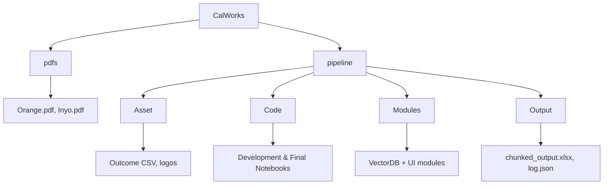

# CalWorks Semantic Search System

A semantic search and question-answering system for exploring California Office of Administrative Resources (CalOAR) and CalWORKs County Self-Assessment (Cal-CSA) documents using vector embeddings, ChromaDB, and Open AI.

---

## 🔍 Project Overview

This project allows users to query complex administrative documents—like the CalWORKs CSA—for specific information on:

- Demographics and community profiles
- Housing affordability and poverty indicators
- Eligibility and program services
- Client engagement and partner collaboration
- System barriers and policy recommendations

The system uses OpenAI embeddings + ChromaDB for vector search and GPT-4 to generate concise, accurate answers.

---

## 💡 Key Features

- **Semantic Search**: Retrieve the most relevant blocks of text from CalOAR documents using vector embeddings (`text-embedding-3-small`).
- **LLM-Enhanced Answers**: Use GPT-4 to synthesize human-readable answers from top matches.
- **Section-Aware Retrieval**: Directly reference document sections like `"Demographic Analysis"` or `"Section 3"`.
- **Gradio UI**: Lightweight frontend for interactive exploration and Q&A.
- **Inference Time Feedback**: Display backend processing time to users for transparency.

## GitHub Folder Structure 

1. pdfs/
Contains the raw Cal-CSA PDFs on the website.

2. pipeline/Asset/
Static assets and GIS outcome CSV.

3. pipeline/Code/
Colab/Notebook versions of data ingestion & search pipeline.

4. pipeline/Modules/
Reusable Python modules for building the vector DB, preprocessing, and web UI components.

5. pipeline/Output/
Results of pipeline runs (chunked outputs, query logs, etc.).

6. app.py
Runs the semantic search system as a Gradio-powered web app.

## 📘 Detailed Instructions

The current GitHub repository provides reusable modules and an `app.py` interface. Many file paths point to Google Drive, as the system was developed in Colab and stores ChromaDB in the cloud for convenience. 

External users can adapt the code by updating path references to match their environment. For **CDSS team members**, a fully configured version is available, no path changes are required.

📄 Full setup instructions are available in the shared Google Drive folder, covering:
- Running Colab pipelines  
- Uploading and embedding new CSA reports  
- Interpreting chunked outputs and using the Gradio search interface

🔗 **[Open the CalWORKs Semantic Search User Guide](https://docs.google.com/document/d/11MolHVaaXLOZpZoYvNhsNJpvJgEAkjIRv0dqgxb6PnE/edit?tab=t.0)**

